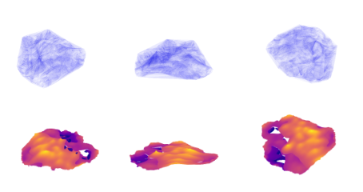

# MP-End2End

Supplementary and Paper in the repository!

Paper Accepted to [ECAI-CompAI Workshop](https://filuta.ai/compai24)!

## Project Description

Microplastics, formed by the breakdown of non-biodegradable plastic, pose a significant threat to aquatic ecosystems. To address this issue, accurate methods for quantifying microplastic concentrations are essential for informing policy and prosecuting offenders. Current detection methods, however, require expensive equipment and are often unreliable. We propose a new, cost-effective methodology that composites depth-from-focus techniques with few-shot classification. Unlike traditional methods that count and measure the size of microplastics, which can yield misleading results due to variability in particle shapes and densities, our approach will yield more accurate quantitative measures of microplastics on the environment. Additionally, qualitative analysis of the data can provide deeper insights into the physical and biological mechanisms driving microplastic ecosystem damage.

## Documentation

The software is still in development, but a working proof-of-concept exists.

### Hardware

Requirements:

- 12V Stepper Motor
- Arduino UNO
- Access to resin 3D Printer

1. Print the translation screw with a resin 3D printer

2. Purchase the [microscope](https://www.amazon.co.uk/Bysameyee-Microscope-Magnification-Endoscope-Compatible/dp/B07SR7YPV5)

3. Purchase a [12 volt stepper motor](https://www.amazon.com/SYUAB-28BYJ-48-Stepper-Compatible-Raspberry/dp/B09YPZ3GCJ/ref=sr_1_3?crid=1OIKHYPJ72EE5&dib=eyJ2IjoiMSJ9.WKdUsd3Shmmkc2gfQGE-TaI7t0sidS_KSCPb3G7ka7RcvzDGJ51-u--U8eqVEix-ntozi7QXdQYelMtKHMPwj3l5QjsQmeS0umHSsfbpyrh2o4KMWyU3FMmcUOtKVyC0gEbe0zZWCe4NIjGNXfT1Y6XKnsRKLQj-5fIV9aDAje7_hA7lM-nn2HoJhbfUXYFoSMMpay_SJ8w2fxys7X3Vlwq0SQs8O72EqZ1v543ct1E.EUZbXseJGuV0SpS6KLvvXU7d_3tNlgP6lZLz43A2egY&dib_tag=se&keywords=12+volt+stepper+motor&qid=1719737261&sprefix=12+volt+ste%2Caps%2C143&sr=8-3)

4. Install the translation screw by carefully removing the existing translation screw

### Software

Requirements:

- NVIDIA GPU
- requirements in requirements.txt

1. Run ```python project/capture.py``` and ```project/code.ino``` on an arduino to collect images of the microplastics.

2. Download negative dataset (download by request due to large size)

3. Run ```python classify.py``` to only get the microplastics in the image

4. Run ```python generate3d.py``` to get the point cloud in ```save.npy```

5. Run ```python visualise.py``` to view the generated mesh in 3D

## Results



There are quite a few dependencies for our project, so you can run our code with ```generate3d.py``` and ```visualise.py``` to generate a 3D map with our collected data.
